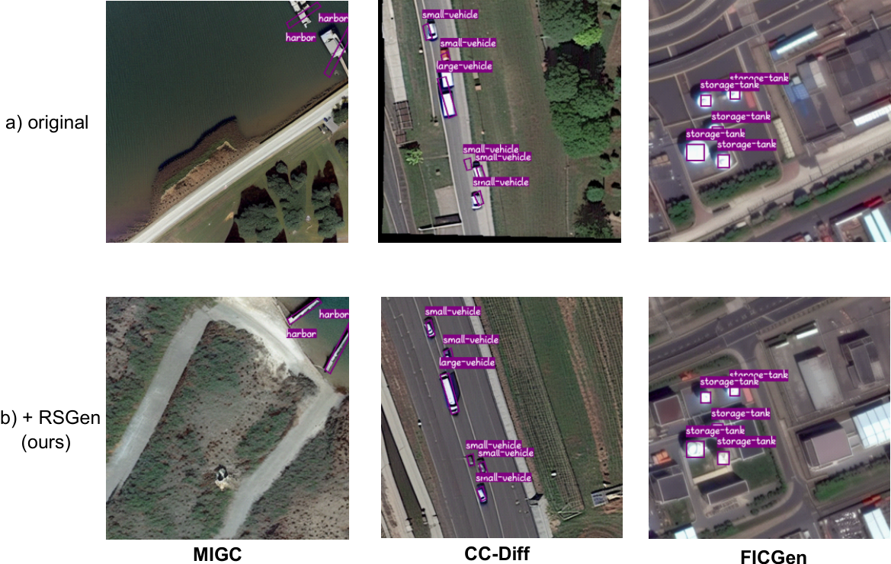

<div align="center">
<h1>RSGen: Enhancing Layout-Driven Remote Sensing Image Generation with Diverse Edge Guidance</h1>
Xianbao Hou<sup>1, 2, ∗</sup>, Yonghao He<sup>2, ∗, ‡</sup>, Zeyd Boukhers<sup>3</sup>, John See<sup>4</sup>, Hu Su<sup>5</sup>, Wei Sui<sup>2, †</sup>,  Cong Yang<sup>1, †</sup>

<sup>1</sup> Soochow University, <sup>2</sup> D-Robotics, <sup>3</sup> Fraunhofer Institute for Applied Information Technology, <sup>4</sup> School of Mathematical and Computing Sciences, <sup>5</sup> Institute of Automation, Chinese Academy of Sciences

<sup>∗</sup> Equal Contribution, <sup>†</sup> Corresponding Author, <sup>‡ </sup> Project Lead

<a href="https://arxiv.org/abs/2603.15484" target="_blank">
  
</a>
</div>


## Abstract
<div style="text-align:justify">
Diffusion models have significantly mitigated the impact of annotated data scarcity in remote sensing (RS). Although recent approaches have successfully harnessed these models to enable diverse and controllable Layout-to-Image (L2I) synthesis, they still suffer from limited fine-grained control and fail to strictly adhere to bounding box constraints. To address these limitations, we propose RSGen, a plug-and-play framework that leverages diverse edge guidance to enhance layout-driven RS image generation. Specifically, RSGen employs a progressive enhancement strategy: 1) it first enriches the diversity of edge maps composited from retrieved training instances via Image-to-Image generation; and 2) subsequently utilizes these diverse edge maps as conditioning for existing L2I models to enforce pixel-level control within bounding boxes, ensuring the generated instances strictly adhere to the layout.
</div>
<br>
<div align=center>

</div>


## Overview
<div align=center>

</div>
RSGen consists of two key components: the Edge2Edge module, designed for generating diverse edge maps, and the L2I FGControl module, which incorporates edge guidance to ensure accurate layout alignment. Together, these components address the challenges of limited diversity and spatial misalignment in remote sensing image generation.

## Getting Started
step 1. Refer to [install.md](./docs/install.md) to install the environment.

step 2. Refer to [datasets.md](./docs/datasets.md) to prepare [DIOR-RSVG](https://github.com/ZhanYang-nwpu/RSVG-pytorch), [DOTA](https://captain-whu.github.io/DOTA/dataset.html), [HRSC2016](https://ieee-dataport.org/documents/hrsc2016) datasets.

step 3. Refer to [train.md](./docs/train.md) for training.

step 4. Refer to [eval.md](./docs/eval.md) for evaluation.

## TODOs
- [x] Release the paper on arXiv.
- [x] Release the complete code.
- [ ] Release generated images by RSGen.


## Contact

If you have any questions about this paper or code, feel free to email me at xbhou2024@stu.suda.edu.cn.

## Acknowledgements
Our work is based on stable [CC-Diff](https://github.com/AZZMM/CC-Diff), [MIGC](https://github.com/limuloo/MIGC), [FICGen](https://github.com/fayewong666999/FICGen), We appreciate their excellent contributions for Layout-to-Image generation.

## Citation
```
@article{hou2026rsgen,
  title={RSGen: Enhancing Layout-Driven Remote Sensing Image Generation with Diverse Edge Guidance},
  author={Hou, Xianbao and He, Yonghao and Boukhers, Zeyd and See, John and Su, Hu and Sui, Wei and Yang, Cong},
  journal={arXiv preprint arXiv:2603.15484},
  year={2026}
}
```
